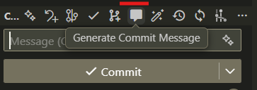

# Gemini Commit Message

Generate high-quality, conventional commit messages with the power of Google's Gemini models, directly within VS Code. This extension analyzes your staged changes and suggests a commit message that follows the [Conventional Commits](https://www.conventionalcommits.org/en/v1.0.0/) specification.

## Features

- **AI-Powered Commit Messages:** Uses Gemini to analyze your staged `git diff` and generate a relevant and concise commit message.
- **Conventional Commits Standard:** Enforces the Conventional Commits standard for clean and readable Git history.
- **Simple Workflow:** A single click on the Source Control panel generates your commit message.
- **Model Selection:** Choose the Gemini model that best fits your needs, from the fastest flash models to the most powerful pro models, via a simple dropdown in the settings.

## Requirements

- A valid Google Gemini API Key.

## Quickstart Guide

### Step 1: Get a Gemini API Key

1.  Visit [Google AI Studio](https://aistudio.google.com/app/apikey).
2.  Click **"Create API key"** and copy your new key.

### Step 2: Configure the Extension in VS Code

1.  In VS Code, open **Settings** (`Ctrl+,` or `Cmd+,`).
2.  Search for **"Gemini Commit Message"**.
3.  In the **"Api Key"** field, paste the Gemini API key you just copied.
4.  (Optional) Use the **"Model"** dropdown to select the Gemini model you wish to use. The default is `gemini-2.5-flash-lite`.

### Step 3: Generate a Commit Message

1.  Open a project that is a Git repository.
2.  Make changes to your code.
3.  Go to the **Source Control** view in VS Code (the Git icon).
4.  **Stage** the files you want to include in the commit by clicking the **`+`** icon next to them.
5.  Click the (message) icon in the Source Control title bar.
6.  The extension will analyze your changes and populate the commit message box with a suggestion from Gemini.

## Extension Settings

This extension contributes the following settings:

- `gemini-commit-message.apiKey`: Your Gemini API Key for authentication.
- `gemini-commit-message.model`: The specific Gemini model to use for generation (e.g., `gemini-2.5-flash-lite`).

## Known Issues

No known issues at this time. Please report any bugs or feature requests on the project's GitHub repository.

## Release Notes

### 1.0.0

- Initial release of **Gemini Commit Message**.
- Generate commit messages from staged changes.
- Support for model selection and API key configuration.

---

**Enjoy a more productive commit workflow!**
